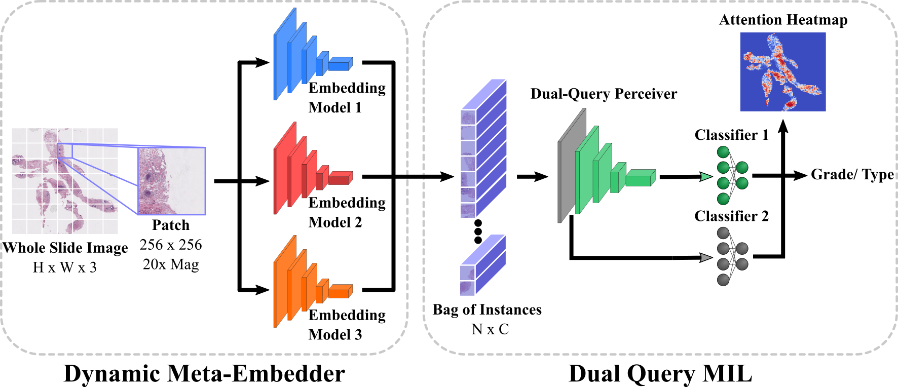

# Dual-Query Multiple Instance Learning for Dynamic Meta-Embedding based Tumor Classification

### [Paper](https://arxiv.org/pdf/2307.07482.pdf)

Implementation of our Dual-Query multiple instance learning approach. A novel method for histopathological slide assessment, extending on the [perceiver](http://proceedings.mlr.press/v139/jaegle21a/jaegle21a.pdf) architecture and leveraging a dynamic meta-embedding strategy.
<br><br>
[Dual-Query Multiple Instance Learning for Dynamic Meta-Embedding based Tumor Classification](https://arxiv.org/pdf/2307.07482.pdf)<br>
[Simon Holdenried-Krafft](https://www.grk2543.uni-stuttgart.de/en/team/Holdenried-Krafft/)<sup>1</sup>, [Peter Somers](https://www.grk2543.uni-stuttgart.de/en/team/Somers-00001/)<sup>3</sup>, [Ivonne A. Montes-Majarro](https://www.grk2543.uni-stuttgart.de/team/Montes-Mojarro/)<sup>2</sup>, [Diana Silimon](https://www.grk2543.uni-stuttgart.de/en/team/Silimon/)<sup>2</sup>, [Cristina Tarín](https://www.grk2543.uni-stuttgart.de/en/team/Tarin-Sauer-00003/)<sup>3</sup>, [Falko Fend](https://www.grk2543.uni-stuttgart.de/en/team/Fend/)<sup>2</sup>, [Hendrik P. A. Lensch](https://uni-tuebingen.de/en/faculties/faculty-of-science/departments/computer-science/lehrstuehle/computergrafik/computer-graphics/staff/prof-dr-ing-hendrik-lensch/)<sup>1</sup><br>
<sup>1</sup>University of Tübingen, <sup>2</sup>University Hospital of Tübingen, <sup>3</sup>University of Stuttgart
<br><br>


## Setup

A conda environment is used for dependency management

```
conda create -n dqmil python=3.7
conda activate dqmil
pip install torch==1.12.1+cu113 torchvision==0.13.1+cu113 --extra-index-url https://download.pytorch.org/whl/cu113
pip install -r requirements.txt
```
## Running

The configuration is based on [hydra](https://hydra.cc/). The settings can be found in the "configs" folder.

To train the Dual-Query Perceiver run:

```
python train.py
```

## Datasets

The implementation relies on lmdbs. Corresponding code to create the datasets will be released in the upcoming weeks. 

